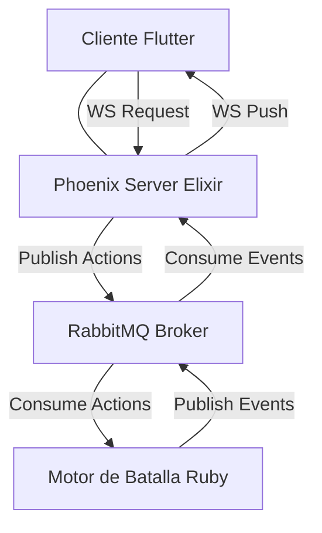

# Especificación de Mensajes y Arquitectura de Comunicación

Este documento detalla la arquitectura de comunicación en tiempo real y el formato de los mensajes (JSON) intercambiados entre el **Cliente (Flutter)**, el **Servidor de Tiempo Real (Elixir/Phoenix)** y el **Motor de Batalla (Ruby/RabbitMQ)**.

---

## 1. Arquitectura General y Flujo de Datos

El sistema combina **WebSockets (Phoenix Channels)** para la comunicación bidireccional de baja latencia con el cliente, y **RabbitMQ (AMQP)** para la mensajería asíncrona entre el servidor de tiempo real y el motor de simulación.



### Canales de Phoenix (WebSockets)
| Tópico | Propósito | Eventos Principales |
| :--- | :--- | :--- |
| `application` | Lobby global y presencia. | `presence_state`, `presence_diff` |
| `player:#{name}` | Canal temporal para el registro del entrenador. | `register` (inbound), `player_event` (outbound) |
| `player:#{id}` | Canal permanente del perfil del entrenador registrado. | `player_event` (outbound) |
| `battle:#{battle_id}` | Combate activo en tiempo real. | `action` (inbound), `battle_event` (outbound) |

### Colas de RabbitMQ (AMQP)
| Cola | Origen | Destino | Propósito |
| :--- | :--- | :--- | :--- |
| `player_actions` | Phoenix | Engine | Solicitar registro de entrenadores. |
| `player_events` | Engine | Phoenix | Emitir el perfil del entrenador (`info`) e historial. |
| `battle_actions` | Phoenix | Engine | Acciones tácticas de los jugadores (ataques, cambios). |
| `battle_events` | Engine | Phoenix | Cambios de estado en la batalla y logs de turno. |

---

## 2. Mensajes del Flujo de Jugadores (Player Flow)

### 2.1 Registro de Entrenador (Acción)
El cliente inicia la conexión uniéndose al canal temporal `player:#{name}` (donde `#{name}` es el nombre deseado del entrenador) y envía la solicitud de registro.

* **Canal Phoenix**: `player:#{name}`
* **Evento Phoenix**: `register`
* **Cola RabbitMQ**: `player_actions` (publicado por `PlayerActionsPublisher`)

**Payload enviado por el cliente (y publicado a RabbitMQ)**:
```json
{
  "event": "register",
  "payload": {
    "name": "AshKetchum"
  }
}
```

### 2.2 Perfil del Jugador (`info` - Evento)
El motor de batalla procesa la solicitud, genera un ID único y crea el perfil inicial del jugador. La respuesta se envía de vuelta a través de la cola de eventos.

* **Cola RabbitMQ**: `player_events` (consumido por `PlayerEventsConsumer`)
* **Canal Phoenix**: `player:#{name}` (temporal, provoca el *Swap*) / `player:#{id}` (permanente)
* **Evento Phoenix**: `player_event`

**Payload de respuesta de perfil (`info`)**:
```json
{
  "event": "info",
  "payload": {
    "player": {
      "id": 101,
      "name": "AshKetchum",
      "teams": [
        {
          "name": "Equipo Lluvia",
          "description": "Estrategia basada en clima de lluvia",
          "monsters": [
            { "name": "Pelipper", "color": "blue" },
            { "name": "Swampert", "color": "blueAccent" },
            { "name": "Kingdra", "color": "cyan" }
          ]
        },
        {
          "name": "Trick Room Core",
          "description": "Control de velocidad",
          "monsters": [
            { "name": "Cresselia", "color": "pinkAccent" },
            { "name": "Ursaluna", "color": "brown" }
          ]
        }
      ],
      "battle_history": {
        "victories": 12,
        "defeats": 5,
        "history": ["win", "defeat", "win", "win", "defeat"]
      }
    }
  }
}
```

*Nota: Al recibir este mensaje por primera vez en el canal temporal `player:#{name}`, el cliente realiza el **swap de canal** desconectándose de este y uniéndose al canal seguro `player:#{id}`.*

---

## 3. Mensajes del Flujo de Batalla (Battle Flow)

### 3.1 Envío de Acciones de Combate (Acción)
Durante la batalla, los jugadores envían sus comandos de turno. Phoenix empaqueta el evento agregando el identificador del jugador (obtenido del estado de su socket seguro).

* **Canal Phoenix**: `battle:#{battle_id}`
* **Evento Phoenix**: `action`
* **Cola RabbitMQ**: `battle_actions` (publicado por `BattleActionsPublisher`)

#### Opción A: Acción de Ataque
```json
{
  "event": "action",
  "payload": {
    "battle_id": "482-913",
    "player_id": 101,
    "action": "attack",
    "move_id": "thunderbolt",
    "target_id": "enemy_pelipper"
  }
}
```

#### Opción B: Acción de Cambio de Monstruo
```json
{
  "event": "action",
  "payload": {
    "battle_id": "482-913",
    "player_id": 101,
    "action": "switch",
    "monster_id": "swampert"
  }
}
```

### 3.2 Actualización del Estado del Combate (Evento)
El motor de batalla ejecuta el turno cuando ambos jugadores han enviado sus acciones, resuelve la velocidad, prioridades y efectos, y difunde el estado resultante.

* **Cola RabbitMQ**: `battle_events` (consumido por `BattleEventsConsumer`)
* **Canal Phoenix**: `battle:#{battle_id}`
* **Evento Phoenix**: `battle_event`

**Payload de actualización**:
```json
{
  "event": "battle_state",
  "payload": {
    "battle_id": "482-913",
    "turn": 3,
    "phase": "waiting_actions", // Fases: waiting_actions, executing, finished
    "active_monster_a": {
      "id": "mon_1",
      "name": "Pikachu",
      "hp": 80,
      "max_hp": 100,
      "status": "normal",
      "owner_id": 101
    },
    "active_monster_b": {
      "id": "mon_2",
      "name": "Pelipper",
      "hp": 0,
      "max_hp": 120,
      "status": "defeated",
      "owner_id": 102
    },
    "weather": "rain",
    "log": [
      "¡Turno 3 comienza!",
      "Pikachu usó Rayo.",
      "¡Es súper eficaz contra Pelipper enemigo!",
      "Pelipper enemigo ha sido derrotado."
    ],
    "winner_id": null
  }
}
```
