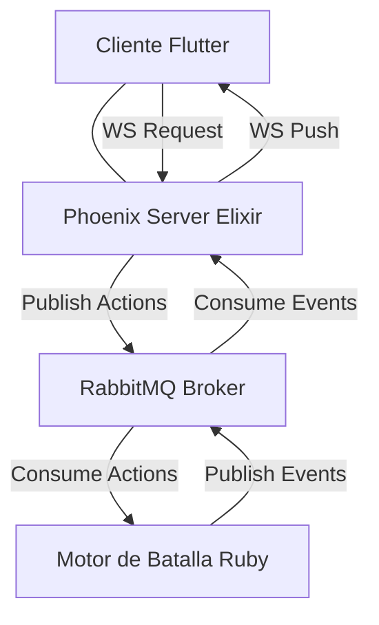
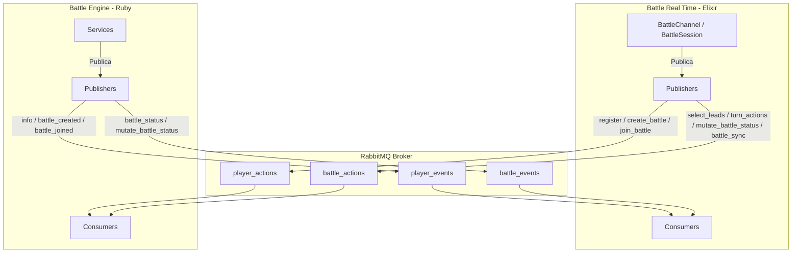

# Especificación de Mensajes y Arquitectura de Comunicación

Este documento detalla la arquitectura de comunicación en tiempo real y el formato de los mensajes (JSON) intercambiados entre el **Cliente (Flutter)**, el **Servidor de Tiempo Real (Elixir/Phoenix)** y el **Motor de Batalla (Ruby/RabbitMQ)**.

---

## 1. Arquitectura General y Flujo de Datos

El sistema combina **WebSockets (Phoenix Channels)** para la comunicación bidireccional de baja latencia con el cliente, y **RabbitMQ (AMQP)** para la mensajería asíncrona entre el servidor de tiempo real y el motor de simulación.



### Detalle de Módulos y Flujos de Colas




### Canales de Phoenix (WebSockets)
| Tópico | Propósito | Eventos Principales |
| :--- | :--- | :--- |
| `application` | Lobby global y presencia. | `presence_state`, `presence_diff` |
| `player:#{name}` | Canal temporal para el registro del entrenador. | `register` (inbound), `player_event` (outbound) |
| `player:#{id}` | Canal permanente del perfil del entrenador registrado. | `player_event` (outbound) |
| `battle:#{battle_id}` | Combate activo en tiempo real. | `action` (inbound), `battle_event` (outbound) |
| `battle_chat:#{battle_id}` | Chat volátil de la batalla en tiempo real. | `send_message` (inbound), `new_message` (outbound) |

### Colas de RabbitMQ (AMQP)
| Cola | Origen | Destino | Propósito |
| :--- | :--- | :--- | :--- |
| `player_actions` | Phoenix | Engine | Solicitar registro de entrenadores. |
| `player_events` | Engine | Phoenix | Emitir el perfil del entrenador (`info`) e historial. |
| `battle_actions` | Phoenix | Engine | Acciones tácticas de los jugadores (ataques, cambios). |
| `battle_events` | Engine | Phoenix | Cambios de estado en la batalla y logs de turno. |

---

## 2. Mensajes del Flujo de Jugadores (Player Flow)

### 2.1 Registro de Entrenador (Acción)
El cliente inicia la conexión uniéndose al canal temporal `player:#{name}` (donde `#{name}` es el nombre deseado del entrenador) y envía la solicitud de registro.

* **Canal Phoenix**: `player:#{name}`
* **Evento Phoenix**: `register`
* **Cola RabbitMQ**: `player_actions` (publicado por `PlayerActionsPublisher`)

**Payload enviado por el cliente (y publicado a RabbitMQ)**:
```json
{
  "event": "register",
  "payload": {
    "name": "AshKetchum"
  }
}
```

### 2.2 Perfil del Jugador (`info` - Evento)
El motor de batalla procesa la solicitud, genera un ID único y crea el perfil inicial del jugador. La respuesta se envía de vuelta a través de la cola de eventos.

* **Cola RabbitMQ**: `player_events` (consumido por `PlayerEventsConsumer`)
* **Canal Phoenix**: `player:#{name}` (temporal, provoca el *Swap*) / `player:#{id}` (permanente)
* **Evento Phoenix**: `player_event`

**Payload de respuesta de perfil (`info`)**:
```json
{
  "event": "info",
  "payload": {
    "player": {
      "id": 101,
      "name": "AshKetchum",
      "team": "A",
      "teams": [
        {
          "name": "Equipo Lluvia",
          "description": "Estrategia basada en clima de lluvia",
          "monsters": [
            { "name": "Pelipper", "color": "blue" },
            { "name": "Swampert", "color": "blueAccent" },
            { "name": "Kingdra", "color": "cyan" }
          ]
        },
        {
          "name": "Trick Room Core",
          "description": "Control de velocidad",
          "monsters": [
            { "name": "Cresselia", "color": "pinkAccent" },
            { "name": "Ursaluna", "color": "brown" }
          ]
        }
      ],
      "battle_history": {
        "victories": 12,
        "defeats": 5,
        "history": ["win", "defeat", "win", "win", "defeat"]
      }
    },
    "battles": [
      {
        "id": 123,
        "opponent": [
          { "name": "Tuto", "team": "A" }
        ]
      },
      {
        "id": 345,
        "opponent": [
          { "name": "Syth", "team": "A" }
        ]
      }
    ]
  }
}
```

*Nota: Al recibir este mensaje por primera vez en el canal temporal `player:#{name}`, el cliente realiza el **swap de canal** desconectándose de este y uniéndose al canal seguro `player:#{id}`.*

### 2.3 Crear Batalla (Acción Inbound)
El jugador solicita crear una nueva sala de batalla.
* **Canal Phoenix**: `player:#{id}`
* **Evento Phoenix**: `action` con action `create_battle`
* **Cola RabbitMQ**: `player_actions`

**Payload enviado por el cliente**:
```json
{
  "event": "action",
  "payload": {
    "action": "create_battle",
    "team_id": 1
  }
}
```

### 2.4 Batalla Creada (`battle_created` - Evento)
El motor confirma la creación y envía el `battle_id` generado.
* **Cola RabbitMQ**: `player_events`
* **Canal Phoenix**: `player:#{id}`
* **Evento Phoenix**: `player_event` (subtipo `battle_created`)

**Payload de respuesta**:
```json
{
  "event": "battle_created",
  "payload": {
    "player_id": 101,
    "battle_id": "482-913"
  }
}
```

### 2.5 Unirse a Batalla (Acción Inbound)
El jugador solicita unirse a una batalla existente mediante un código.
* **Canal Phoenix**: `player:#{id}`
* **Evento Phoenix**: `action` con action `join_battle`
* **Cola RabbitMQ**: `player_actions`

**Payload enviado por el cliente**:
```json
{
  "event": "action",
  "payload": {
    "action": "join_battle",
    "battle_id": "482-913",
    "team_id": 2
  }
}
```

### 2.6 Batalla Unida (`battle_joined` - Evento)
El motor confirma que el jugador se unió exitosamente a la batalla.
* **Cola RabbitMQ**: `player_events`
* **Canal Phoenix**: `player:#{id}`
* **Evento Phoenix**: `player_event` (subtipo `battle_joined`)

**Payload de respuesta**:
```json
{
  "event": "battle_joined",
  "payload": {
    "player_id": 102,
    "battle_id": "482-913"
  }
}
```

---

## 3. Mensajes del Flujo de Batalla (Battle Flow)

### 3.1 Envío de Acciones de Combate (Acción Inbound)
Durante la batalla, los jugadores envían sus comandos de turno o de control inmediato (como rendirse). Phoenix empaqueta el evento agregando el identificador del jugador (obtenido del estado de su socket seguro).

* **Canal Phoenix**: `battle:#{battle_id}`
* **Evento Phoenix**: `action`
* **Cola RabbitMQ**: `battle_actions` (publicado por `BattleActionsPublisher` en forma de eventos consolidados o de control)

#### Opción A: Acción de Ataque
```json
{
  "event": "action",
  "payload": {
    "action": "attack",
    "move_id": "thunderbolt",
    "targets": ["enemy_pelipper"]
  }
}
```

#### Opción B: Acción de Cambio de Monstruo
```json
{
  "event": "action",
  "payload": {
    "action": "switch",
    "monster_id": "swampert"
  }
}
```

#### Opción C: Acción de Rendición (Forfeit)
```json
{
  "event": "action",
  "payload": {
    "action": "forfeit"
  }
}
```

#### Opción D: Selección de Líder (Select Lead)
En la fase de `setting_up`, el jugador elige a su primer Pokémon.
```json
{
  "event": "action",
  "payload": {
    "action": "select_lead",
    "lead": 1
  }
}
```

#### Opción E: Solicitud de Sincronización (Sync State)
Pide al servidor forzar la retransmisión del estado del combate.
```json
{
  "event": "action",
  "payload": {
    "action": "sync_state"
  }
}
```

---

### 3.2 Publicación Consolidada y de Control a RabbitMQ
El servidor de tiempo real (Elixir) valida las acciones recibidas y las publica a la cola `battle_actions` usando contratos Ecto estructurados.

#### Publicación A: Acciones del Turno Consolidadas (`turn_actions`)
Cuando se completa el turno y ambos jugadores han ingresado sus acciones, se publica un único mensaje consolidando los movimientos en la cola `battle_actions`.
```json
{
  "event": "turn_actions",
  "payload": {
    "battle_id": "482-913",
    "turn": 1,
    "actions": [
      {
        "action": "attack",
        "player_id": "101",
        "move_id": "thunderbolt",
        "targets": ["enemy_pelipper"]
      },
      {
        "action": "switch",
        "player_id": "102",
        "monster_id": "swampert"
      }
    ]
  }
}
```

#### Publicación B: Selección de Líderes Consolidados (`select_leads`)
Cuando ambos jugadores han seleccionado a su líder en `setting_up`, el servidor envía ambos líderes al motor.
```json
{
  "event": "select_leads",
  "payload": {
    "battle_id": "482-913",
    "actions": [
      { "player_id": 101, "lead": 1 },
      { "player_id": 102, "lead": 4 }
    ]
  }
}
```

#### Publicación C: Mutación de Estado de Combate (`mutate_battle_status`)
Cuando un jugador abandona/se rinde, el servidor de tiempo real notifica al motor para finalizar el combate. (Reemplaza a la antigua acción de `terminate_battle`).
```json
{
  "event": "mutate_battle_status",
  "payload": {
    "battle_id": "482-913",
    "status": "finished",
    "reason": "El jugador AshKetchum se rinde."
  }
}
```

#### Publicación D: Sincronización Forzada (`battle_sync`)
El servidor pide al motor que vuelva a despachar el `battle_status` a través de `battle_events`.
```json
{
  "event": "battle_sync",
  "payload": {
    "battle_id": "482-913"
  }
}
```

---

### 3.3 Actualización del Estado del Combate (Evento Outbound)
El servidor o el motor de batalla difunden el estado resultante a los clientes.

#### Evento A: Estado del Combate (`battle_state`)
* **Canal Phoenix**: `battle:#{battle_id}`
* **Evento Phoenix**: `battle_event` (subtipo `battle_state`)

**Payload de actualización**:
```json
{
  "event": "battle_state",
  "payload": {
    "battle_id": "482-913",
    "battle_format": "1v1",
    "turn": 1,
    "phase": "in_progress", // Fases: waiting_players, setting_up, in_progress, finished
    "expected_players": 2,
    "connected_players": 2,
    "turn_expires_at": 1781223600000,
    "players": [
      {
        "id": "101",
        "name": "AshKetchum",
        "team": "A",
        "alive_pokemon_count": 3,
        "active_monster": {
          "id": 1,
          "name": "Pikachu",
          "hp": 80,
          "max_hp": 100,
          "level": 50,
          "status": "normal"
        }
      },
      {
        "id": "102",
        "name": "Gary",
        "team": "B",
        "alive_pokemon_count": 2,
        "active_monster": {
          "id": 4,
          "name": "Pelipper",
          "hp": 0,
          "max_hp": 120,
          "level": 50,
          "status": "defeated"
        }
      }
    ],
    "log": [
      "¡Ambos entrenadores listos! Comienza el combate.",
      "Pikachu usó Rayo.",
      "¡Es súper eficaz contra Pelipper enemigo!",
      "Pelipper enemigo ha sido derrotado."
    ]
  }
}
```

#### Evento A.2: Equipo Privado (`setup_pokemons` / `sync_team`)
Durante todas las fases de la batalla (incluyendo `setting_up`), el servidor envía a cada jugador sus estadísticas de equipo completas por un canal privado para evitar filtrar los stats al rival.
* **Canal Phoenix Privado**: `battle_events:#{battle_id}:#{player_id}`
* **Evento Phoenix**: `battle_event` (subtipo `setup_pokemons`)

#### Evento B: Combate Finalizado (`battle_ended`)
Enviado inmediatamente cuando ocurre una rendición o finalización forzada de la partida.
* **Canal Phoenix**: `battle:#{battle_id}`
* **Evento Phoenix**: `battle_event` (subtipo `battle_ended`)

```json
{
  "event": "battle_ended",
  "payload": {
    "battle_id": "482-913",
    "reason": "El entrenador AshKetchum se ha retirado. Combate finalizado."
  }
}
```

---

## 4. Canal de Chat de Batalla (Battle Chat Flow)

Este canal gestiona la mensajería instantánea dentro de una batalla. Al ser un chat **volátil**, los mensajes no se persisten en base de datos ni en colas de RabbitMQ; simplemente se retransmiten (broadcast) a todos los clientes que están escuchando la misma sala.

### 4.1 Unirse al Canal (Join)
Para unirse, el cliente se conecta al canal especificando el `battle_id` y puede enviar parámetros opcionales para identificarse (`username` y `player_id`).

* **Canal Phoenix**: `battle_chat:#{battle_id}`
* **Parámetros de entrada (opcionales)**:
  - `username`: Nombre a mostrar (por defecto `"Anonymous"`).
  - `player_id`: ID del jugador (opcional).

**Payload de confirmación al unirse**:
```json
{
  "battle_id": "123",
  "username": "Ash Ketchum",
  "player_id": "player_abc"
}
```

### 4.2 Envío de Mensaje (Acción Inbound)
Cualquier miembro de la sala de chat puede enviar un mensaje al canal.

* **Evento Phoenix**: `send_message`

**Payload enviado por el cliente**:
```json
{
  "body": "¡Prepárate para perder!"
}
```

### 4.3 Recepción de Mensaje (Evento Outbound / Broadcast)
Al recibir un mensaje válido, el servidor añade los detalles del remitente junto con una marca de tiempo y lo propaga a toda la sala de chat.

* **Evento Phoenix**: `new_message`

**Payload recibido por los clientes**:
```json
{
  "body": "¡Prepárate para perder!",
  "username": "Ash Ketchum",
  "player_id": "player_abc",
  "timestamp": "2026-06-10T23:02:05Z"
}
```

